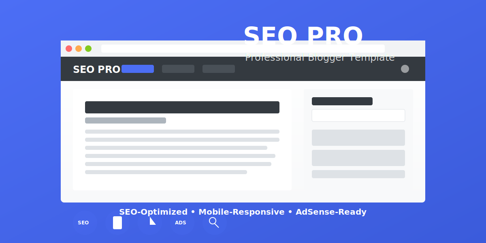

# SEO PRO - Professional Hugo Blogger Template



SEO PRO is a professional, SEO-optimized Hugo blog template designed for marketers, bloggers, and content creators who want to maximize their online visibility. This template comes with built-in AdSense integration, responsive design, and lightning-fast loading speeds.

## Key Features

- **SEO Optimized**: Structured data, meta tags, and Open Graph support
- **AdSense Ready**: Multiple ad placement positions optimized for high CTR
- **Mobile Responsive**: Looks great on all devices and screen sizes
- **Fast Loading**: Optimized code and lazy loading for quick page loads
- **Professional Search**: Advanced search functionality with keyboard navigation
- **Modern UI**: Clean, professional design with customizable color schemes
- **Social Media Integration**: Easy sharing and profile linking
- **Table of Contents**: Automatic generation for long-form content
- **Schema.org Markup**: Enhanced search engine visibility
- **Responsive Widgets**: Sidebar components that work on all screen sizes

## Installation

1. Download or clone this repository to your Hugo project's themes directory
2. Update your site's config.toml to use this theme
3. Customize settings as needed

## Configuration

The template is configured through your site's `config.toml` file:

```toml
baseURL = "/"
languageCode = "en-us"
title = "SEO PRO - Professional Blogger Template"
enableRobotsTXT = true
paginate = 10

[params]
  description = "A professional SEO-optimized blog template for marketers and content creators"
  images = ["img/og-image.jpg"]
  mainSections = ["posts"]
  logo = "SEO PRO" # Text logo (could be replaced with image)
  copyright = "© 2023 SEO PRO. All rights reserved."
  dateFormat = "January 2, 2006"
  customCSS = ["css/style.css", "css/search.css", "css/search-overlay.css", "css/adsense.css"]
  customJS = ["js/main.js", "js/lazyload.js"]
  lazyLoading = true
  # Adsense (uncomment and replace with your own publisher ID)
  # adsensePublisherId = "ca-pub-XXXXXXXXXXXXXXXX"
  # Social Media
  twitter = "seopro"
  facebook = "seopro"
  instagram = "seopro"
  linkedin = "seopro"
  pinterest = "seopro"
  youtube = "seopro"
```

## AdSense Integration

To integrate Google AdSense:

1. Uncomment the `adsensePublisherId` parameter in `config.toml`
2. Replace `ca-pub-XXXXXXXXXXXXXXXX` with your actual AdSense Publisher ID
3. Ads will automatically appear in the designated positions throughout the template

## Adding Content

Create new content with Hugo's content management commands:

```bash
hugo new posts/my-new-post.md
```

The template supports the following content types:
- posts (main blog content)
- pages (static pages)

## Using Shortcodes

This template includes custom shortcodes to enhance your content:

### AdSense In-Article Ads
```

```

### Table of Contents
```

```

## Customization

The template can be customized by:

1. Modifying CSS files in the `static/css` directory
2. Editing layout templates in the `layouts` directory
3. Adjusting configuration options in your `config.toml`

## Performance Optimization

This template includes:

- Lazy loading for images (using both native browser support and fallback)
- Minified CSS and JavaScript
- Optimized asset loading
- Responsive image handling

## Browser Compatibility

SEO PRO is compatible with:
- Chrome (latest)
- Firefox (latest)
- Safari (latest)
- Edge (latest)
- Opera (latest)

## License

This template is licensed under the MIT License.

## Credits

- Hugo - The world's fastest framework for building websites
- Bootstrap - Front-end component library
- Font Awesome - Icon library
- Feather Icons - Simple, elegant icons
- Unsplash - Demo images (not included in production)

## Support

For questions or support, please open an issue in the GitHub repository.